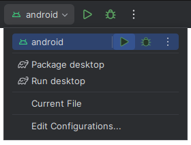

# [Template] KMP Android And Desktop

Kotlin Multiplatform project template with **Android** and **desktop** targets, and **Compose Multiplatform**.

## Versions

Latest combination without errors and warnings (2024-10-07):

- Kotlin: 1.8.10 (compatible with compose compiler 1.4.3)
- AGP: 7.4.0 (compatible with Kotlin Plugin 1.8.10)
- JDK: 17 (supported for AGP 7.4.0)
- Android SDK: 33.0.0 (compatible with AGP 7.4.0)

## Build (with IDE)

1. Download and install [Intellij IDEA](https://www.jetbrains.com/idea/download).
2. Download and install the JDK 17.
3. Open the project in Intellij IDEA.

### Android

1. Install the Android Plugin for IntelliJ.
2. Install the Android SDK (File -> Settings -> Languages & Frameworks -> Android SDK).
3. Create a file `local.properties` at the root of the project, with the path to the Android SDK: `sdk.dir = ANDROID_SDK_PATH`.
4. Sync Gradle (File -> Sync Project with Gradle Files).
5. Select android run configuration and run it (Shift + F10).   
6. Or install the app with `gradlew :android:installDebug`(connected device or emulator is required).

### Desktop

1. Run with `gradlew :desktop:run` (or select run desktop run configuration).
2. Or package a distribution with `gradlew :desktop:packageDistributionForCurrentOS` (build/compose/binaries).

## Screenshots

|                        Android                        |                      Desktop                      |
|:-----------------------------------------------------:|:-------------------------------------------------:|
|                |                |
|                    Android Dialog                     |                  Desktop Dialog                   |
|  |  |

## Docs
- [Configure a Gradle project | Kotlin](https://kotlinlang.org/docs/gradle-configure-project.html)
- [Understand Multiplatform project structure | Kotlin](https://kotlinlang.org/docs/multiplatform-discover-project.html)
- [Compose Multiplatform](https://www.jetbrains.com/lp/compose-multiplatform/)

## Examples
- [Compose Multiplatform Template](https://github.com/JetBrains/compose-multiplatform-template)
- [Compose Multiplatform Examples](https://github.com/JetBrains/compose-multiplatform/tree/master/examples)